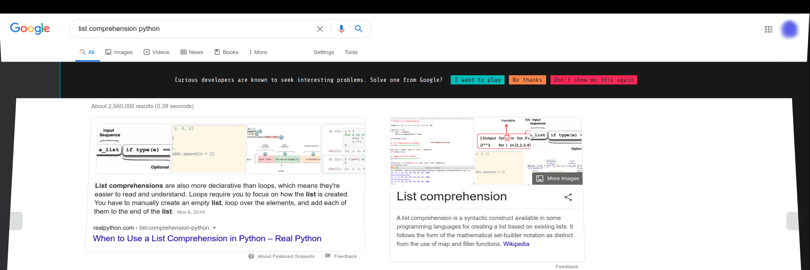
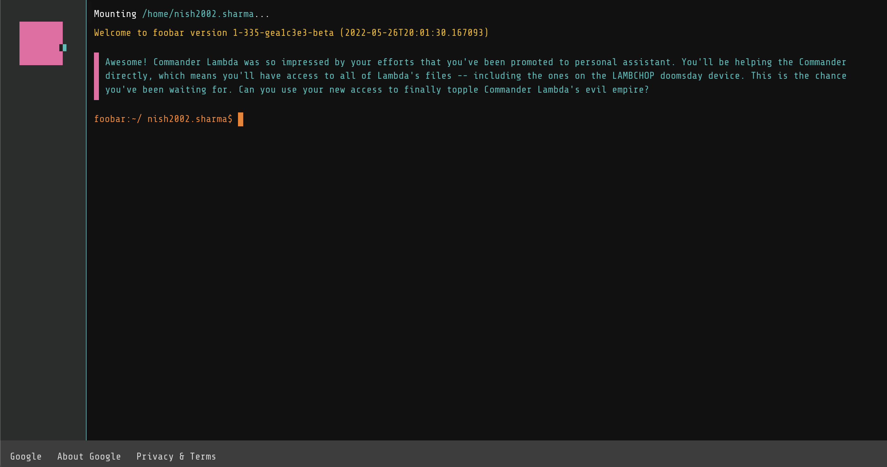

# Google Foobar 🎯🤔

Foobar is an exciting, yet secretive "Invite-Only" Challenge by [Google](https://about.google/).
There are Five Levels, each with a different number of challenges - Following a Story.

I got a Challenge Invite - when i didn't knew what it was, Thanks to my curiosity, that paid off. I checked it out! Yayy! 🤩🔥

### Level 1

- [Solar-Doomsday](https://github.com/nishant-ai/foobar-with-Google/tree/main/Level%201/solar-doomsday)

### Level 2
    
- [Power-Hungry](https://github.com/nishant-ai/foobar-with-Google/tree/main/Level%202/1%20-%20Power%20Hungry)
- [en-route-salute](https://github.com/nishant-ai/foobar-with-Google/tree/main/Level%202/2%20-%20en%20route%20salute)

Checkout the [Journal](https://github.com/nishant-ai/foobar-with-Google/blob/main/journal.md) to Catch up with the Story line!

**Important:** I have uploaded these solutions for programmers like me to practise, Any Plagiarism is not expected, and Ethical Code of Conduct Must be Followed.

**_Happy Learning!_** ∞🎯

